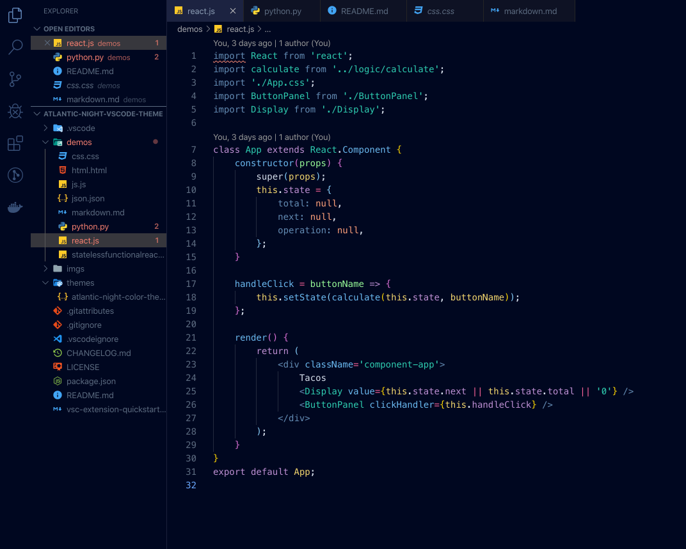
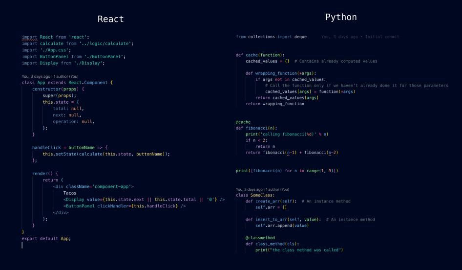

# Atlanitc Night :new_moon_with_face: :whale:

A Visual Studio Code theme inspired by the deep blues of the Atlantic. With coding at night in mind, the colour choices have been taking into consideration with accessibility in mind. All colours have been picked from [Color Safe](http://colorsafe.co) which empowers designers with beautiful and accessible colour palettes based on [WCAG Guidelines](http://webaim.org/blog/wcag-2-0-and-link-colors/) of text and background contrast ratios.

I took this theme on after being inspired by Sarah Drasner's [creating a vscode theme](https://css-tricks.com/creating-a-vs-code-theme/) article.

# Atlantic Night



# Installation

1.  Install [Visual Studio Code](https://code.visualstudio.com/)
2.  Launch Visual Studio Code
3.  Choose **Extensions** from menu
4.  Search for `atlantic night`
5.  Click **Install** to install it
6.  Click **Reload** to reload the Code
7.  From the menu bar click: Code > Preferences > Color Theme > **Atlantic Night**

## Preferences shown in the preview

The font in the preview image is Menlo, at a size of 14px and a tabSize of 4.

```
"editor.fontFamily": "Menlo",
"editor.fontSize": 14,
"editor.tabSize": 4,
```

The preview image is using [Bracket Pair Colorizer](https://marketplace.visualstudio.com/items?itemName=CoenraadS.bracket-pair-colorizer), a really cool extension that highlights matching brackets. This can help reduce unwanted errors.

## Misc

This is my first attempt at creating a theme, so if you see something amiss, please feel free to [file an issue](https://github.com/mrpbennett/atlantic-night-vscode-theme/issues)! I'm sure there are things I missed.

Any relevant changes for each version are documented in the changelog. Please update and check the changelog before filing any issues, as they may have already been taken care of.
